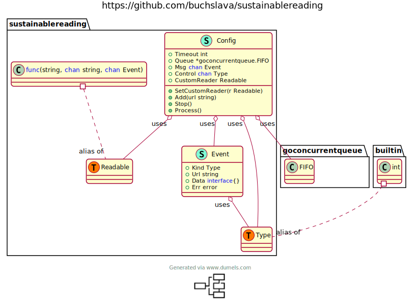

# sustainablereading - A simple approach to painlessly collecting large amounts of information over HTTP

The package `sustainablereading` offers a public interface with methods for gathering a bunch of information over HTTP. It contains the function to retry after a failed download attempt.

## Installation

`go get github.com/buchslava/sustainablereading`

## How does it work

The main goal of this solution is to provide bulk HTTP reads even if an error occurs. The solution provides functionality to let you retry a failed attempt. This solution uses a [queue](https://github.com/enriquebris/goconcurrentqueue) as the main data structure. Some thread is expecting one or several new URLs to be processed and queued up. It takes an URL from the queue and tries to read after that. If an error occurs, it tries again after a while. This solution is useful in the case of the following rule. The API allows you to read information N times in period M. For example, the URL https://api.bar.foo only provides 100 successful calls in 30 minutes. Otherwise, it will throw a bad HTTP status code, say 403.

## Test Environment

In terms of functionality above, it makes sense to have a test application that allows for this behavior. So, you can use
[this one](https://github.com/buchslava/sustainablereading/blob/master/stub/stub.go)

### How to run

`cd stub`
`go run stub.go`

This solution uses port 3100 by default. If you want to use another one, do the following: "go run stub go <YOUR_PORT>"

`go run stub go 3200` if you want to run the application on port 3200

Also [here](https://github.com/buchslava/sustainablereading/blob/master/stub/stub.go#L14-L15) you can change the rule regarding reading restrictions.

In addition, you can run the application many times on different ports.

### How to use

The Test Environment application works as follows. It creates 99 endpoints `http://localhost/data1` -- `http://localhost/data99`. Each of them prints a random string and gives a status code 200 in case of a successful call. Otherwise, it gives a 403 status code and a "Forbidden" message. So, if you run the app and call, say, `http://localhost/data1` 4 times immediately it will be ok. The fifth time will fail. You got a proper result after some timeout. It's 10 seconds in the demo application (see below).

## The basic example

Here is a [basic demo example](https://github.com/buchslava/sustainablereading/blob/master/demo/demo.go)

One important thing. If you want to run the demo application, you must first run the Test Environment application because the demo application works [with it](https://github.com/buchslava/sustainablereading/blob/master/demo/demo.go#L20).

### How to run

- In Terminal #1

`cd stub`
`go run stub.go`

- In Terminal #2

`cd demo`
`go run demo.go`

### Brief explanation

Here is the complete example code.

```go
package main

import (
	"fmt"
	"time"

	"sustainablereading"
)

const (
	Total = 50
)

func main() {
	ch := make(chan sustainablereading.Event)
	sr := sustainablereading.NewSustainableReading(10, ch)
	current := 1

	for i := 1; i < Total+1; i++ {
		sr.Add(fmt.Sprintf("http://localhost:3100/data%d", i))
	}

Loop:
	for {
		select {
		case msg := <-ch:
			if msg.Kind == sustainablereading.Data {
				fmt.Println(TimeLabel(), current, "of", Total, msg.Url, string(msg.Data.([]byte)))
				current = current + 1
			}
			if msg.Kind == sustainablereading.Pause {
				fmt.Println(TimeLabel(), "...")
			}
			if msg.Kind == sustainablereading.SysError {
				fmt.Println(TimeLabel(), msg.Err)
			}
		default:
			if current > Total {
				sr.Stop()
				break Loop
			}
		}
	}
}

func TimeLabel() string {
	currentTime := time.Now()
	return currentTime.Format("15:04:05")
}
```

Let's clarify some important points.

1. First of all, you need to create a communication channel. It's mandatory because you need to receive messages from the solution.

```go
ch := make(chan sustainablereading.Event)
```

2. Second, you have to instantiate an object that represents the main logic

```go
sr := sustainablereading.NewSustainableReading(10, ch)
```

and pass a communication channel into it. 3. Now you can tell the main logic about new URL (URLs):

```go
sr.Add("http://localhost:3100/data1")
sr.Add("http://localhost:3100/data2")
//...
```

4. You are ready for interaction with the main logic:

```go
	for {
		select {
		case msg := <-ch:
    // do message processing here
		default:
    // ...
		}
	}

```

5. There is the following logic in the [basic example](https://github.com/buchslava/sustainablereading/blob/master/demo/demo.go)

```go
// ...
const (
	Total = 50
)
// ...
	ch := make(chan sustainablereading.Event)
	sr := sustainablereading.NewSustainableReading(10, ch)
	current := 1

	for i := 1; i < Total+1; i++ {
		sr.Add(fmt.Sprintf("http://localhost:3100/data%d", i))
	}

Loop:
	for {
		select {
		case msg := <-ch:
			if msg.Kind == sustainablereading.Data {
				fmt.Println(TimeLabel(), current, "of", Total, msg.Url, string(msg.Data.([]byte)))
				current = current + 1
			}
    // ...
    default:
			if current > Total {
				sr.Stop()
				break Loop
			}
		}
	}
```

- Make a communication channel, main logic object and add 50 URLs to be processed
- Wait for messages from the main logic: `case msg := <-ch:`
- If a URL processed successfully print the result and increase a counter:

```go
			if msg.Kind == sustainablereading.Data {
				fmt.Println(TimeLabel(), current, "of", Total, msg.Url, string(msg.Data.([]byte)))
				current = current + 1
			}
```

- If there are no messages and all of the URLs are processed then break a main loop:

```go
    default:
			if current > Total {
				sr.Stop()
				break Loop
			}
		}
```

## Classes diagram

<!-- https://www.dumels.com/ -->


